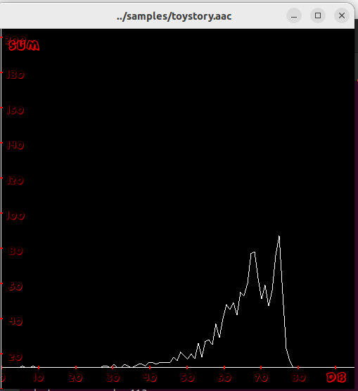

# simple-histogram
plays AAC data inside ADTS frame and draws its histogram

 

**Описание**

Воспроизводит содержимое файла формата AAC-ADTS с выводом упрощенной гистограммы.

**Зависимости**

* Библиотека `asound`
  >Воспроизведение аудио сэмплов
* Библиотеки `sfml`
 >Отображение упрощенной гистограммы

**Сборка**

`git clone https://github.com/m-khomutov/simple-histogram.git`  
`cd simple-histogram`  
`mkdir build`  
`cd build`  
`cmake ..`  
`make all`  

**Запуск (пример)**

`simple_histogram -f ../fonts/#44v2s.ttf -a ../samples/toystory.aac`

**Параметры запуска (выводятся опцией -h)**

```
$  simple_histogram -h

usage: ./simple_histogram [-a -f -s -g -h]

plays AAC data inside ADTS frame and draws its histogram

options:
	-a, audio file with aac-adts format
	-f, font to draw axis captions and ticks
        -s, sum axis scale factor (def. 1.0)
	-g, window geometry (def. 512x512)
	-h, show this help message and exit

  ```

**Дополнительные каталоги**
* fonts
 >Содержит примерный шрифт `#44v2s.ttf` 
* samples
 >Содержит примерный файл ожидаемого формата `toystory.aac`

